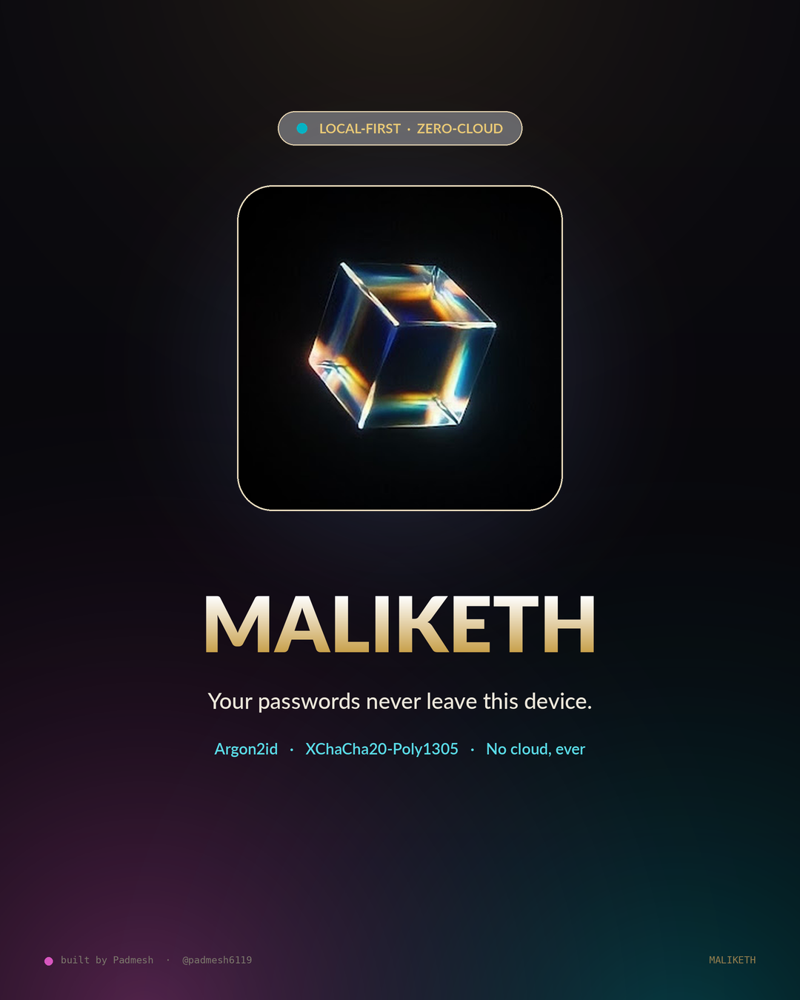
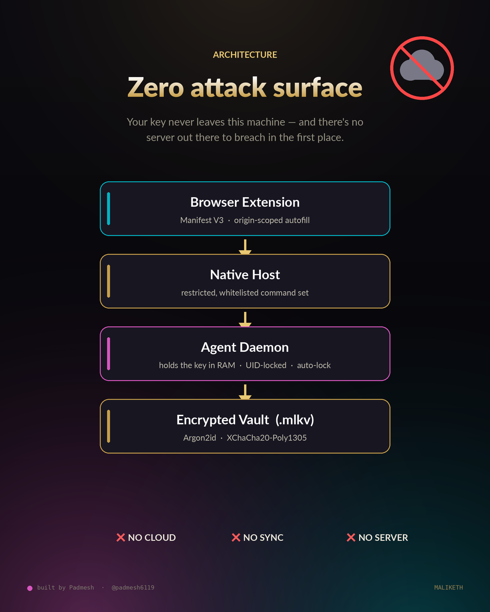
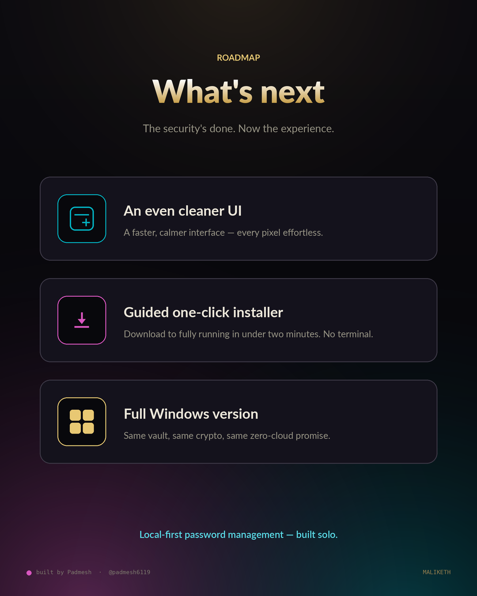

<div align="center">



# Maliketh

**A local-first password vault with browser autofill. No cloud. No servers. No one but you.**


</div>

---

Maliketh stores your credentials in an encrypted file on **your machine**. Secrets are sealed
with **XChaCha20-Poly1305** under a key derived from your master password with **Argon2id**.
The decrypted key lives only inside a persistent local **agent** process — never on disk,
never in the browser, never in the desktop UI. There is no server to breach, no account to
phish, and no company that can read your vault.

## Why it's different

- 🛡️ **Argon2id** key derivation (t=3, 64 MiB, p=4) — memory-hard, brutal to brute-force on GPUs.
- 🔒 **XChaCha20-Poly1305** AEAD — the vault header (KDF params, salt, nonce) is authenticated as additional data; tamper with a byte and it refuses to open.
- 🧠 **Key-holding agent** — one process holds the unlocked key in RAM, behind a `0600` Unix socket gated by a peer-UID check, with idle auto-lock and brute-force backoff.
- 🌐 **Origin-scoped autofill** — credentials only surface on the exact domain they belong to; the origin is browser-attested, never page-supplied.
- 🚪 **Master password never leaves the desktop** — unlocking is desktop-only by design, off the browser attack surface.
- ⚡ Live TOTP, strong password/passphrase generator, password history, clipboard auto-clear, CSV import/export — and a polished in-browser onboarding page.

## Architecture

<div align="center"></div>

```
            ┌────────────────────┐     unix socket (uid-checked, 0600)
            │  Qt desktop app    │◄────────────────────────────┐
            │  ui/app.py         │  unlock / CRUD / generate    │
            └────────────────────┘                              │
                                                                ▼
 browser ─ extension ─ native messaging ─ core/native_host.py ─► core/agent.py
  content   (MV3)        (stdio frames)    (restricted, origin   (holds the key in
  popup     background                      scoped bridge)        RAM; vault + autolock)
                                                                │
                                                                ▼
                                                     core/vault.py ──► vault.mlkv
                                                     (Argon2id + XChaCha20-Poly1305)
```

## Security model

- Master password → Argon2id → 32-byte key (per-vault salt). The vault is re-encrypted with a
  fresh 24-byte random nonce on every save; KDF params, salt and nonce are bound into the
  ciphertext as AEAD additional data.
- The key is held in an `mlock`-ed (best-effort) `bytearray` and zeroed on lock.
  **Honest caveat:** in pure Python this is best-effort, not a hard guarantee — Argon2 and
  decryption produce intermediate copies the GC may leave in memory or swap. Hardware-grade
  key hygiene belongs in a C/Rust core, which this isn't (yet).
- The master password **never** travels through the extension or native host.
- Autofill is **always user-initiated**, scoped to a browser-attested origin, and the password
  is fetched from the agent only at the moment of fill.

> **Status:** functional end-to-end, but **not independently audited**. Treat it as a strong
> personal/learning manager, not a drop-in replacement for an audited product.

## Quick start

```bash
# 1. set up the environment
./setup.sh                       # or: python3 -m venv .venv && . .venv/bin/activate && pip install -r requirements.txt

# 2. load the extension
#    chrome://extensions → Developer mode → Load unpacked → select extension/
#    copy the generated extension ID

# 3. register the native messaging host
.venv/bin/python install.py --extension-id <THE_EXTENSION_ID>

# 4. launch the desktop app and create your vault
.venv/bin/python ui/app.py
```

The agent starts automatically on first use (spawned detached). Data lives under
`~/.local/share/maliketh/` — override with `MALIKETH_HOME`.

### Makefile shortcuts

```bash
make setup     # create venv + install deps
make run       # launch the desktop app
make test      # run the test suite
make cli ARGS="list"
```

## Usage

- **Desktop** — add/edit/delete entries, reveal & copy (clipboard auto-clears after 20 s),
  live TOTP codes, generate passwords/passphrases, change master password, import/export,
  set the idle auto-lock timeout.
- **Browser** — focus a login field to get a fill picker; submit a login to be offered a save.
  The toolbar popup lists matches for the current tab, generates passwords, locks the vault,
  and links to the **How to use** onboarding page.

## Project layout

| Path | Role |
|------|------|
| `core/vault.py` | crypto + vault model (`*.mlkv`) |
| `core/agent.py` | persistent session daemon — the only key-holder |
| `core/native_host.py` | restricted, origin-scoped browser bridge |
| `core/client.py` | socket client + agent autostart |
| `core/secure.py` | mlock / zeroing secret buffer |
| `core/protocol.py` | framing, paths, constants |
| `core/cli.py` | scripting interface to the agent |
| `ui/app.py` | PySide6 desktop app |
| `extension/` | MV3 browser extension (+ onboarding page) |
| `install.py` | native-host registration |

## Roadmap

<div align="center"></div>

- 🎨 A cleaner, redesigned desktop UI
- 🧭 A guided one-click installer (no terminal)
- 🪟 A native Windows build
- 🔐 Per-entry encryption, a fixed extension key for a stable ID, Firefox packaging, and a Rust core for hardened key memory

## Notes

- `maliketh_host.json` is **generated** per machine by `install.py` (it embeds your home path
  and extension ID) and is gitignored — don't commit it.
- No license file is included yet; until one is added, all rights are reserved.

---

<div align="center">

Designed &amp; built solo by **Padmesh** · [@padmesh6119](https://github.com/padmesh6119) 

</div>
